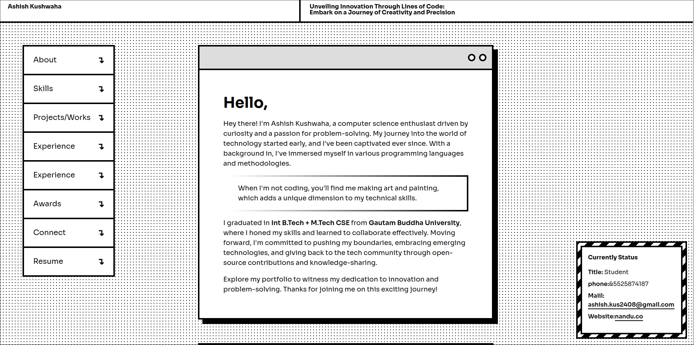

# My Portfolio Website

Welcome to my portfolio website! This repository houses the code and content for my personal portfolio website, where I showcase my projects, skills, and passion for computer science.

 

## Sections

- **About Me:** Learn more about my background, interests, and goals in the field of computer science.

- **Projects:** Explore a variety of coding projects I've worked on, each with detailed descriptions and links to the code.

- **Education and Working Experiance:** Read my blog posts on various technical topics, tutorials, and insights related to computer science.

- **Contact:** Reach out to me through the provided contact information if you have any questions or collaboration opportunities.

Feel free to explore the website and get in touch with me. Thank you for visiting!
